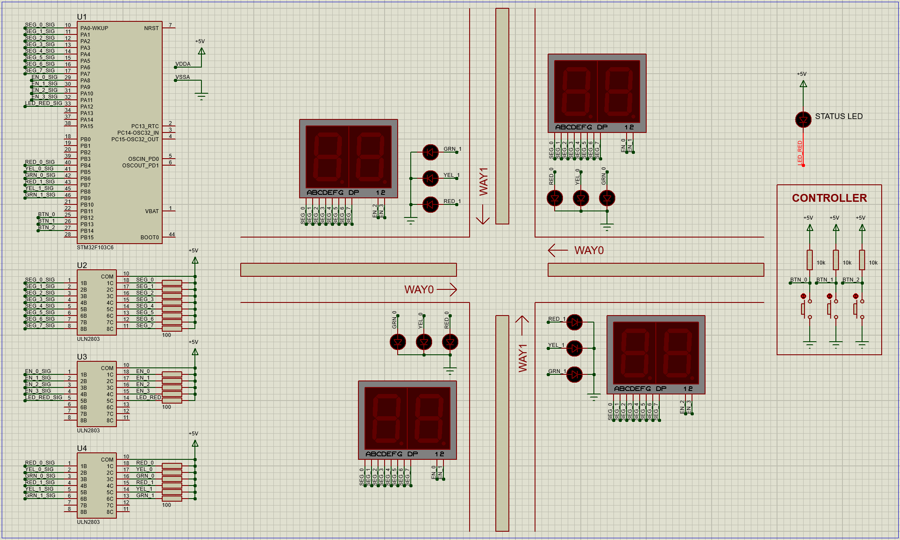

# MICROCONTROLLER - MICROPROCESSOR, LABORATORY 3

This is the second lab to get familiar with Buttons & Switches through a big exercises focused on simulate a 2-WAYs-TRAFFIC-LIGHT.

## 1. Schematic for this lab

I simulated the source code on an STM32F103C6 using Proteus 8. The schematic looks like this:

The pin assignments are listed in the table below:

| PIN      | PIN LABEL      | PIN      | PIN LABEL      |
|:---------|:---------------|:---------|:---------------|
| PA0      | SEG_0          | PB0      | not in use     |
| PA1      | SEG_1          | PB1      | not in use     |
| PA2      | SEG_2          | PB2      | not in use     |
| PA3      | SEG_3          | PB3      | not in use     |
| PA4      | SEG_4          | PB4      | LED_RED_0      |
| PA5      | SEG_5          | PB5      | LED_YEL_0      |
| PA6      | SEG_6          | PB6      | LED_GRN_0      |
| PA7      | SEG_7          | PB7      | LED_RED_1      |
| PA8      | EN_0           | PB8      | LED_YEL_1      |
| PA9      | EN_1           | PB9      | LED_GRN_1      |
| PA10     | EN_2           | PB10     | not in use     |
| PA11     | EN_3           | PB11     | not in use     |
| PA12     | LED_RED        | PB12     | BTN_0          |
| PA13     | not in use     | PB13     | BTN_1          |
| PA14     | not in use     | PB14     | BTN_2          |
| PA15     | not in use     | PB15     | not in use     |

## 2. How to run the exercises source code?

1. Ensure that all hardware connections are correct as described above. The timer is configured with prescaler = 799, counter = 9 so the TICK is 1 ms.

2. Clone this Project and Run.